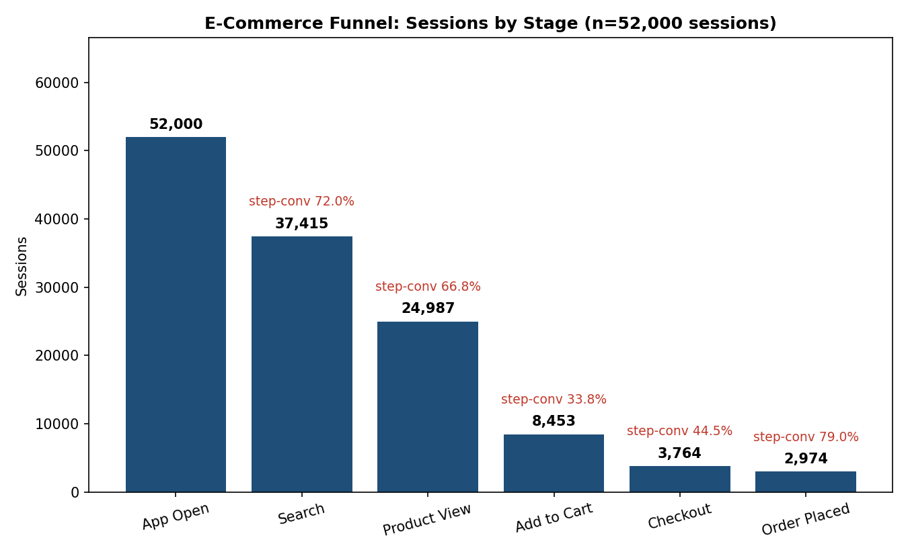
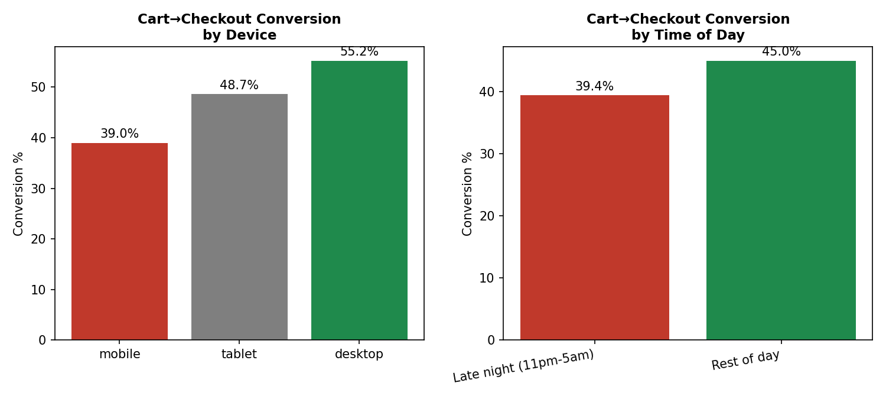
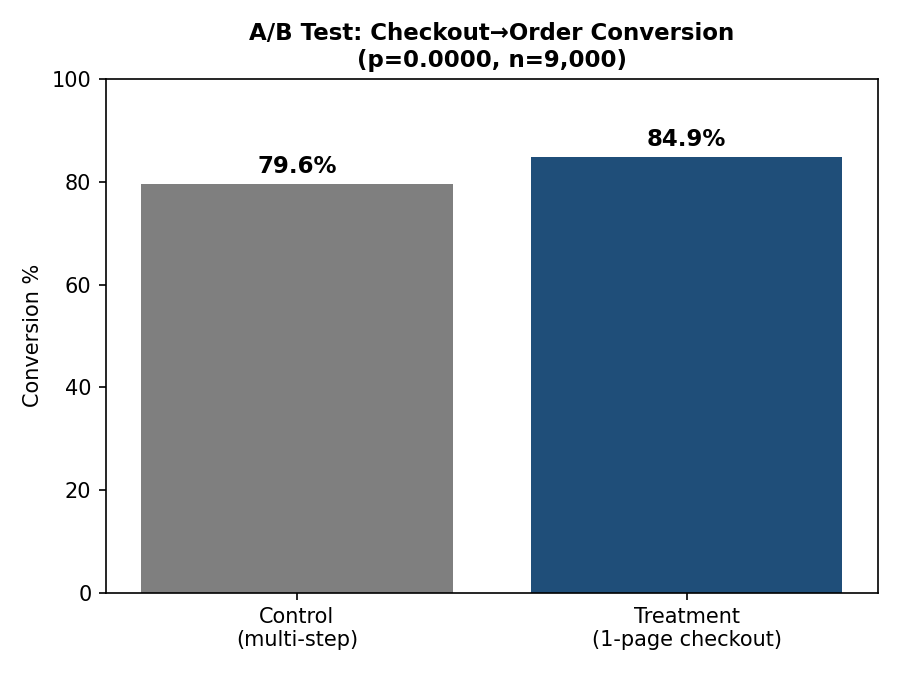
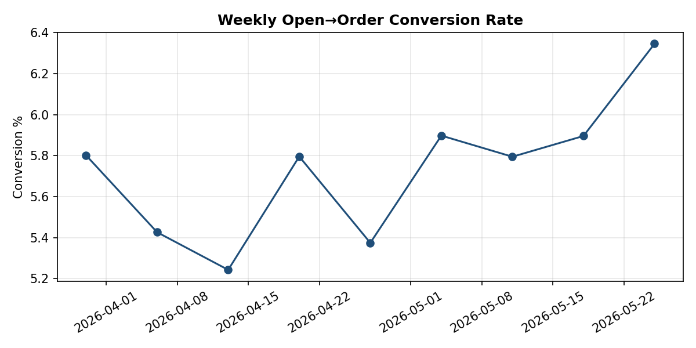

# E-Commerce Funnel, Root Cause & A/B Test Analysis (Python)

## Project Overview

This project analyzes user behavior through a 6-stage mobile e-commerce funnel (App Open → Search → Product View → Add to Cart → Checkout → Order) to identify where users drop off, diagnose *why*, and test a fix using a proper A/B test.

Where the [SQL project](https://github.com/SiddharthSinghJadon/ecommerce-sql-business-analysis) analyzes **historical marketplace-level KPIs** (revenue, delivery, sellers) on the Olist dataset, this project focuses on **session-level user behavior** - funnel conversion, root-cause segmentation, and experiment design - using Python (pandas, NumPy, matplotlib, SciPy).

---

## A note on the data

No public dataset ships with raw session-level clickstream *and* a live randomized A/B test at once, so - as is standard for personal analytics projects of this kind - the dataset is **simulated** with `numpy` (`generate_data.py`), using conversion-rate assumptions grounded in publicly reported e-commerce funnel benchmarks (single-digit open→order conversion, mobile traffic majority, checkout as the steepest drop-off).

To make the exercise a genuine test of the analysis (not just a demo), two "ground-truth" effects are deliberately seeded into the generator *before* any analysis is run:
1. Mobile sessions convert cart→checkout at a meaningfully lower rate than desktop (simulating a clunky mobile checkout form).
2. A simulated "1-page checkout" redesign lifts checkout→order conversion by a fixed amount.

The analysis below was written without looking at the generator's parameters, then checked against them - the same "recover a known signal" sanity check used to validate an analytics pipeline before pointing it at production data. Full assumptions are in `generate_data.py`.

**Scale:** 52,000 simulated sessions over 60 days; 9,000-user A/B test.

---

## 1. Funnel Analysis

| Stage | Sessions | Step Conversion |
|---|---|---|
| App Open | 52,000 | - |
| Search | 37,415 | 72.0% |
| Product View | 24,987 | 66.8% |
| Add to Cart | 8,453 | 33.8% |
| Checkout | 3,764 | 44.5% |
| Order Placed | 2,974 | 79.0% |

**Overall App Open → Order conversion: 5.72%**



**Finding:** The single biggest percentage-point drop is Product View → Add to Cart (66.8% → 33.8%, a 33-point fall), but the step with the most *actionable* leverage is Cart → Checkout (44.5%) - it's the stage where intent is highest (user already added an item) yet conversion is worse than the view→cart step, which is unusual and worth investigating. Section 2 does exactly that.

---

## 2. Root Cause Analysis: Why does Cart → Checkout underperform?

Rather than accept "44.5%" as a fact, I segmented it by device and time of day to find where the drop concentrates.



| Segment | Cart→Checkout Conversion |
|---|---|
| Mobile | 39.0% |
| Tablet | 48.7% |
| Desktop | 55.2% |
| Late night (11pm–5am) | 39.4% |
| Rest of day | 45.0% |

**Statistical check (mobile vs. desktop):** two-proportion z-test, z = -13.42, p < 0.0001 - the mobile gap is not noise; it's a real, large effect (n=5,278 mobile / 2,468 desktop sessions).

**Root cause:** Mobile carries 62% of all traffic but converts cart→checkout 16 points worse than desktop. Since mobile is the majority channel, this single segment is responsible for the largest share of lost checkouts in the entire funnel - a textbook case of "the average hides the problem." A secondary, smaller effect (late-night sessions convert ~5.6pp worse) suggests fatigue/distraction compounds the mobile issue but isn't the primary driver.

**Recommendation:** Prioritize a mobile checkout redesign over broad-based marketing fixes - the ROI on closing a 16pp gap on 62% of traffic dwarfs any funnel-top intervention.

---

## 3. A/B Test: Does a simplified checkout close the gap?

**Hypothesis:** A single-page checkout (vs. the existing multi-step flow) increases checkout→order conversion.

**Design:** 9,000 users randomly assigned to control (multi-step, existing) or treatment (1-page checkout), measured on checkout→order conversion. Two-proportion z-test.



| Arm | Conversion | n |
|---|---|---|
| Control (multi-step) | 79.60% | 4,515 |
| Treatment (1-page checkout) | 84.91% | 4,485 |

**Result:** +5.30pp absolute lift (6.7% relative), z = 6.58, **p < 0.0001** - statistically significant, not explained by chance.

**Recommendation:** Ship the 1-page checkout. At current order volume, a 5.3pp lift on the checkout→order step compounds with the mobile fix in Section 2 - the two interventions target adjacent stages of the same drop-off and should be rolled out together, with mobile users prioritized for the redesign given Section 2's findings.

---

## 4. Bonus: Weekly Conversion Trend



Open→order conversion held in a 5.2–6.3% band over the 8-week window with a mild upward drift - useful as a baseline to monitor post-launch, so any post-rollout lift from Sections 2–3 is distinguishable from normal week-to-week noise.

---

## Techniques Demonstrated

- Funnel construction and step-wise conversion analysis
- Root cause analysis via segmentation (device, time-of-day) with statistical validation (two-proportion z-test), not just eyeballing bar heights
- A/B test design and hypothesis testing (z-test, p-values, absolute vs. relative lift)
- Time-series aggregation (weekly resampling) for trend monitoring
- Synthetic data generation with seeded ground-truth effects, for pipeline validation

## Tools

Python · pandas · NumPy · Matplotlib · SciPy (`stats.norm`)

## Project Structure

```
ecom-funnel-ab-rca/
├── README.md
├── generate_data.py       # simulates sessions.csv and ab_test_checkout.csv
├── analysis.py            # funnel, RCA, A/B test, weekly trend + all charts
├── data/
│   ├── sessions.csv
│   └── ab_test_checkout.csv
└── charts/
    ├── 1_funnel.png
    ├── 2_rca_segments.png
    ├── 3_ab_test.png
    └── 4_weekly_trend.png
```

